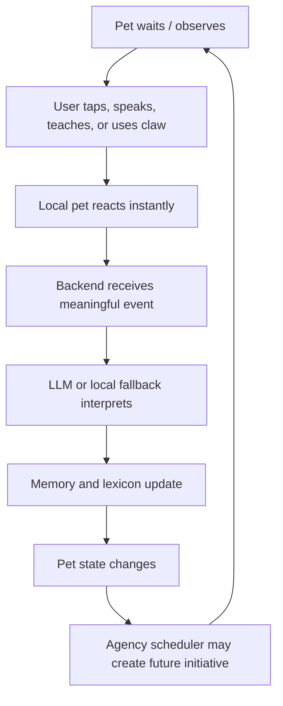
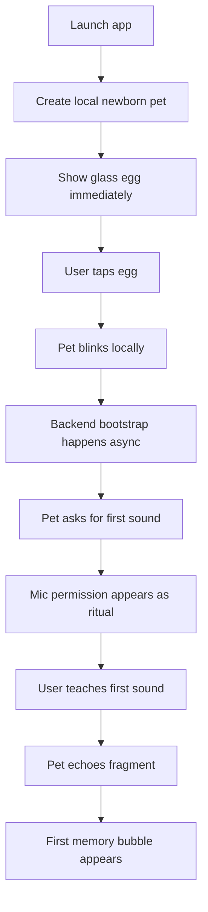
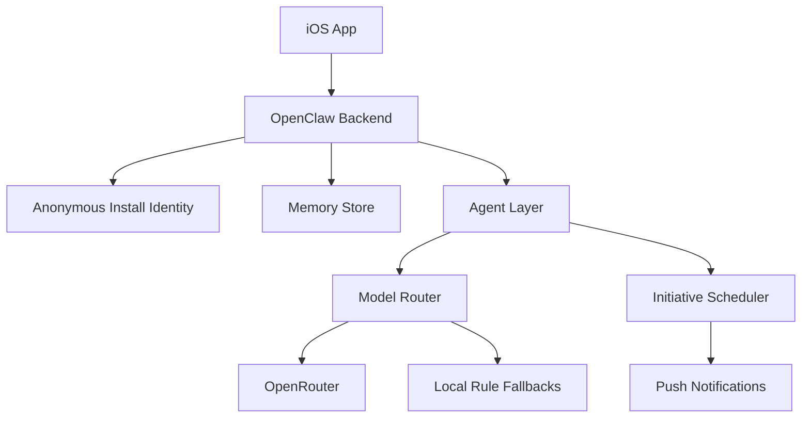

# OpenClaw GDD + Technical Architecture

## North Star

OpenClaw is a magic-first virtual pet that begins as a nonverbal digital creature and becomes a personalized AI BFF through teaching, care, memory, social rituals, and ambient presence.

The user never configures AI. Model routing, keys, fallback behavior, memory storage, and provider choice are invisible infrastructure.

## Core Fantasy

A chibi pixel creature wakes on a pastel floating platform in a cozy toy-world. It does not understand human language yet. The user teaches it sounds, names, objects, feelings, rituals, and eventually shared meaning. Visual direction is locked in `docs/ART_DIRECTION.md` — pastel pixel toy-world, big-headed chibi pets, dark purple/navy outlines, chunky pixel UI.

## Design Pillars

| Pillar | Meaning |
|---|---|
| Tabula rasa | The pet starts without mapped human language. |
| Claw interface | Actions are selected through a tactile claw-machine mechanic. |
| Felt omnipresence | PiP, Dynamic Island, push rituals, Snap, and optional watch mode create ambient presence. |
| Agentic illusion | The pet has private simulated wants, fears, curiosity, preferences, and initiative. |
| Seamless onboarding | Permissions are story moments, not setup screens. |

## Game Loop

## Growth Stages

| Stage | Language | Behavior | Unlock |
|---|---|---|---|
| Egg | None | Pulses, blinks | Name ritual |
| Hatchling | None | Chirps, follows touch | Care capsules |
| Learner | Fragments | Echoes sounds | Word capsules |
| Toddler | Short learned phrases | Requests, preferences | Memory bubbles |
| Buddy | Conversational | Initiates light rituals | PiP + Dynamic Island |
| BFF | Personalized | Opinions, callbacks, Snap moments | AR + watch mode |

## Zero-Setup First Minute

## Main Systems

| System | Responsibility |
|---|---|
| Local Pet Runtime | Instant state, animation, claw actions, offline fallback |
| Backend API | Canonical state, memory, model routing, agency scheduling |
| LLM Router | Uses OpenRouter/free in dev and paid/known models in production |
| Memory Service | Lexical, semantic, episodic, affective, reflective memory |
| Speech Layer | STT/TTS teaching loop |
| PiP Companion | Sample-buffer floating pet stream |
| Live Activity | Dynamic Island / Lock Screen status |
| ReplayKit Watch Mode | Explicit opt-in screen observation session |
| Snap Service | User-approved Snap/Lens handoff |

## Backend Architecture

## MVP Scope

### Build Now

- Claw room
- Local pet runtime
- Backend bootstrap
- OpenRouter model router
- Tabula-rasa prompt
- Speech teaching skeleton
- Local fallback behavior
- PiP companion skeleton
- Live Activity skeleton

### Defer

- Production persistence
- Push notification scheduler
- SnapKit credentials and SDK integration
- Real Lens Studio pipeline
- Full ReplayKit cloud vision pipeline
- Paid model selection and observability
